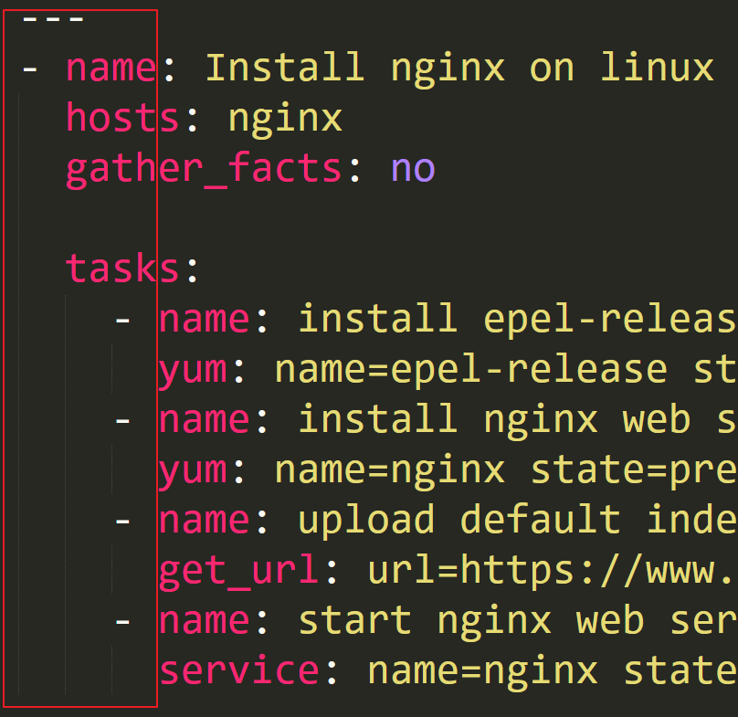

# Ansible_Devops_Tool


| 작성날짜 | 2022-02-21                             |
| -------- | -------------------------------------- |
| 참고     | 인프런/처음부터 설치하며 배우는 앤서블 |
| 링크     | https://bit.ly/359AUtP                 |


* **기존방식**

CODE > BUILD > TEST > RELEASE > OPERATE 


* **DEVOPS 방식**

code > build > test > release > deploy > operate > monitor > plan 


* **많이 사용하는 툴들**

git/jira > gradle > JUnit > Jenkins > Ansible > Nagios


****


### Configuration Management Tools 비교표 


* 왜 Ansible을 배우나요??

| 구성 관리 툴 | 특징                                                         | agent 설치 |
| ------------ | ------------------------------------------------------------ | ---------- |
| Puppet       | 가장 먼저 2005년에 출시되서 복잡도가 높고, 사용하기 어려움,  | 필요       |
| Chef         | Puppet과 4년 차이나지만, 복잡도가 높음                       | 필요       |
| Salt         | Salt도 위에 툴보다 2년 뒤에나왔지만 크게 발전하지 못함       | 필요       |
| Ansible      | 1. 관리받는 대상에 agent가 필요 없어서  기술적으로 복잡도도 낮다.<br />2. 관리할 때 Yaml을 사용하는데 Json과 비슷해서  쉽고 간편함<br />3. Puppet와 Chef는 오래전에 출시했고, 바꾸기가 쉽지않을 정도로 복잡도가 높다. 그리고 Ansible은 배우기 쉽다.<br />(Source  RightScale 2017 State of the Cloud Report 기반) | 불필요     |


Ansible 설치


```
OS : CENTOS 7 

구성

Ansible-Server 192.168.111.134  - Master
Ansible-node  192.168.111.135 - Test node1
Ansible-node  192.168.111.136 - Test node2


설치
yum repolist
레파지토리 조회

ansible 설치패키지를 셋팅할 수 있는공간설정이 필요함
epel을 우선적으로 설치해야함
yum install epel-release -y

yum -y install ansible


셋팅
vi /etc/ansible/hosts에 관리할 서버 아이피 입력
vi /etc/resolve.conf에 DNS 서버 IP 등록


설치 후 테스트
ansible all -m ping -k 
```


* Ansible이 참조하는 파일은 어떤것이 있나요?

```
1. Ansible의 환경 설정 파일
/etc/ansible/ansible.cfg 

2. Ansible이 접속하는 호스트들 
/etc/ansible/hosts 
```


* Ansible의 옵션값이란? 

```
-i : (--inventory-file) 적용될 호스트들에 대한 파일
-m : (--module-name) 모듈을 선택할 수 있도록
-k : (--ask-pass) 패스워드를 물어보도록 설정
-K : (--ask-become-pass) 권리자로 권한 상승
--list-hosts : 적용되는 호스트들을 확인


예시 커맨드
ansible all -i test -m ping -k (테스트 파일에 있는 호스트를 읽어서 파이썬 라이브러리인 ping을 실행)
ansible nginx  -m ping -k (/etc/ansible/hosts에 있는 [nginx] 그룹을 읽어서 파이썬 라이브러리인 ping을 실행)
ansible nginx  -m ping --list-hosts (ansible 적용될 호스트들 출력해줌)


```


어떻게 Ansible을 활용할 수 있나요?


* 1. uptime 확인하기

* ansible all -m shell -a "uptime" -k

```
192.168.111.136 | CHANGED | rc=0 >>
 21:06:01 up 30 min,  3 users,  load average: 0.00, 0.01, 0.05
 
192.168.111.135 | CHANGED | rc=0 >>
 21:06:01 up 30 min,  3 users,  load average: 0.00, 0.01, 0.05
```


* 2. 디스크 용량 확인하기

* ansible all -m shell -a "df -h" -k

```
Filesystem               Size  Used Avail Use% Mounted on
devtmpfs                 1.9G     0  1.9G   0% /dev
tmpfs                    1.9G     0  1.9G   0% /dev/shm
tmpfs                    1.9G   12M  1.9G   1% /run
tmpfs                    1.9G     0  1.9G   0% /sys/fs/cgroup
/dev/mapper/centos-root   46G  1.4G   44G   3% /
/dev/sda1               1014M  150M  864M  15% /boot
tmpfs                    378M     0  378M   0% /run/user/0
192.168.111.135 | CHANGED | rc=0 >>
Filesystem               Size  Used Avail Use% Mounted on
devtmpfs                 1.9G     0  1.9G   0% /dev
tmpfs                    1.9G     0  1.9G   0% /dev/shm
tmpfs                    1.9G   12M  1.9G   1% /run
tmpfs                    1.9G     0  1.9G   0% /sys/fs/cgroup
/dev/mapper/centos-root   46G  1.4G   44G   3% /
/dev/sda1               1014M  151M  864M  15% /boot
tmpfs                    378M     0  378M   0% /run/user/0
```


* 3. 메모리 상태 확인하기
*  ansible all -m shell -a "free -h" -k

```
192.168.111.135 | CHANGED | rc=0 >>
              total        used        free      shared  buff/cache   available
Mem:           3.7G        290M        3.1G         11M        283M        3.2G
Swap:          3.9G          0B        3.9G
192.168.111.136 | CHANGED | rc=0 >>
              total        used        free      shared  buff/cache   available
Mem:           3.7G        291M        3.1G         11M        283M        3.2G
Swap:          3.9G          0B        3.9G
```


* 4. 새로운 유저 만들기
* ansible all -m user -a "name=bloter password=1234" -k

```
[WARNING]: The input password appears not to have been hashed. The 'password' argument must be encrypted for
this module to work properly.
192.168.111.135 | CHANGED => {
    "ansible_facts": {
        "discovered_interpreter_python": "/usr/bin/python"
    },
    "changed": true,
    "comment": "",
    "create_home": true,
    "group": 1000,
    "home": "/home/bloter",
    "name": "bloter",
    "password": "NOT_LOGGING_PASSWORD",
    "shell": "/bin/bash",
    "state": "present",
    "system": false,
    "uid": 1000
}

192.168.111.136 | CHANGED => {
    "ansible_facts": {
        "discovered_interpreter_python": "/usr/bin/python"
    },
    "changed": true,
    "comment": "",
    "create_home": true,
    "group": 1000,
    "home": "/home/bloter",
    "name": "bloter",
    "password": "NOT_LOGGING_PASSWORD",
    "shell": "/bin/bash",
    "state": "present",
    "system": false,
    "uid": 1000
}

 
```


* 5. 파일 전송하기
* ansible nginx -m copy-a "src=./bloter.file dest=/tmp/" -k

```
192.168.111.135 | CHANGED => {
    "ansible_facts": {
        "discovered_interpreter_python": "/usr/bin/python"
    },
    "changed": true,
    "checksum": "da39a3ee5e6b4b0d3255bfef95601890afd80709",
    "dest": "/tmp/bloter.file",
    "gid": 0,
    "group": "root",
    "md5sum": "d41d8cd98f00b204e9800998ecf8427e",
    "mode": "0644",
    "owner": "root",
    "secontext": "unconfined_u:object_r:admin_home_t:s0",
    "size": 0,
    "src": "/root/.ansible/tmp/ansible-tmp-1645446027.5-2217-242509752499124/source",
    "state": "file",
    "uid": 0
}


192.168.111.136 | CHANGED => {
    "ansible_facts": {
        "discovered_interpreter_python": "/usr/bin/python"
    },
    "changed": true,
    "checksum": "da39a3ee5e6b4b0d3255bfef95601890afd80709",
    "dest": "/tmp/bloter.file",
    "gid": 0,
    "group": "root",
    "md5sum": "d41d8cd98f00b204e9800998ecf8427e",
    "mode": "0644",
    "owner": "root",
    "secontext": "unconfined_u:object_r:admin_home_t:s0",
    "size": 0,
    "src": "/root/.ansible/tmp/ansible-tmp-1645446027.84-2219-58720463184656/source",
    "state": "file",
    "uid": 0
}
```


* 6. 서비스 설치
*  ansible nginx -m copy -a "src=./bloter.file dest=/tmp/" -k


```
SSH password:

 
192.168.111.136 | CHANGED => {
    "ansible_facts": {
        "discovered_interpreter_python": "/usr/bin/python"
    },
    "changed": true,
    "changes": {
        "installed": [
            "httpd"
        ]
    },
    "msg": "",
    "rc": 0,
    "results": [
        "Loaded plugins: fastestmirror\nLoading mirror speeds from cached hostfile\n * base: mirror.kakao.com\n * extras: mirror.kakao.com\n * updates: mirror.kakao.com\nResolving Dependencies\n--> Running transaction check\n---> Package httpd.x86_64 0:2.4.6-97.el7.centos.4 will be installed\n--> Processing Dependency: httpd-tools = 2.4.6-97.el7.centos.4 for package: httpd-2.4.6-97.el7.centos.4.x86_64\n--> Processing Dependency: /etc/mime.types for package: httpd-2.4.6-97.el7.centos.4.x86_64\n--> Processing Dependency: libaprutil-1.so.0()(64bit) for package: httpd-2.4.6-97.el7.centos.4.x86_64\n--> Processing Dependency: libapr-1.so.0()(64bit) for package: httpd-2.4.6-97.el7.centos.4.x86_64\n--> Running transaction check\n---> Package apr.x86_64 0:1.4.8-7.el7 will be installed\n---> Package apr-util.x86_64 0:1.5.2-6.el7 will be installed\n---> Package httpd-tools.x86_64 0:2.4.6-97.el7.centos.4 will be installed\n---> Package mailcap.noarch 0:2.1.41-2.el7 will be installed\n--> Finished Dependency Resolution\n\nDependencies Resolved\n\n================================================================================\n Package           Arch         Version                     Repository     Size\n================================================================================\nInstalling:\n httpd             x86_64       2.4.6-97.el7.centos.4       updates       2.7 M\nInstalling for dependencies:\n apr               x86_64       1.4.8-7.el7                 base          104 k\n apr-util          x86_64       1.5.2-6.el7                 base           92 k\n httpd-tools       x86_64       2.4.6-97.el7.centos.4       updates        94 k\n mailcap           noarch       2.1.41-2.el7                base           31 k\n\nTransaction Summary\n================================================================================\nInstall  1 Package (+4 Dependent packages)\n\nTotal download size: 3.0 M\nInstalled size: 10 M\nDownloading packages:\n--------------------------------------------------------------------------------\nTotal                                              1.9 MB/s | 3.0 MB  00:01     \nRunning transaction check\nRunning transaction test\nTransaction test succeeded\nRunning transaction\n  Installing : apr-1.4.8-7.el7.x86_64                                       1/5 \n  Installing : apr-util-1.5.2-6.el7.x86_64                                  2/5 \n  Installing : httpd-tools-2.4.6-97.el7.centos.4.x86_64                     3/5 \n  Installing : mailcap-2.1.41-2.el7.noarch                                  4/5 \n  Installing : httpd-2.4.6-97.el7.centos.4.x86_64                           5/5 \n  Verifying  : httpd-tools-2.4.6-97.el7.centos.4.x86_64                     1/5 \n  Verifying  : apr-1.4.8-7.el7.x86_64                                       2/5 \n  Verifying  : mailcap-2.1.41-2.el7.noarch                                  3/5 \n  Verifying  : httpd-2.4.6-97.el7.centos.4.x86_64                           4/5 \n  Verifying  : apr-util-1.5.2-6.el7.x86_64                                  5/5 \n\nInstalled:\n  httpd.x86_64 0:2.4.6-97.el7.centos.4                                          \n\nDependency Installed:\n  apr.x86_64 0:1.4.8-7.el7                      apr-util.x86_64 0:1.5.2-6.el7   \n  httpd-tools.x86_64 0:2.4.6-97.el7.centos.4    mailcap.noarch 0:2.1.41-2.el7   \n\nComplete!\n"
    ]
}
192.168.111.135 | CHANGED => {
    "ansible_facts": {
        "discovered_interpreter_python": "/usr/bin/python"
    },
    "changed": true,
    "changes": {
        "installed": [
            "httpd"
        ]
    },
    "msg": "",
    "rc": 0,
    "results": [
        "Loaded plugins: fastestmirror\nLoading mirror speeds from cached hostfile\n * base: mirror.kakao.com\n * extras: mirror.kakao.com\n * updates: mirror.kakao.com\nResolving Dependencies\n--> Running transaction check\n---> Package httpd.x86_64 0:2.4.6-97.el7.centos.4 will be installed\n--> Processing Dependency: httpd-tools = 2.4.6-97.el7.centos.4 for package: httpd-2.4.6-97.el7.centos.4.x86_64\n--> Processing Dependency: /etc/mime.types for package: httpd-2.4.6-97.el7.centos.4.x86_64\n--> Processing Dependency: libaprutil-1.so.0()(64bit) for package: httpd-2.4.6-97.el7.centos.4.x86_64\n--> Processing Dependency: libapr-1.so.0()(64bit) for package: httpd-2.4.6-97.el7.centos.4.x86_64\n--> Running transaction check\n---> Package apr.x86_64 0:1.4.8-7.el7 will be installed\n---> Package apr-util.x86_64 0:1.5.2-6.el7 will be installed\n---> Package httpd-tools.x86_64 0:2.4.6-97.el7.centos.4 will be installed\n---> Package mailcap.noarch 0:2.1.41-2.el7 will be installed\n--> Finished Dependency Resolution\n\nDependencies Resolved\n\n================================================================================\n Package           Arch         Version                     Repository     Size\n================================================================================\nInstalling:\n httpd             x86_64       2.4.6-97.el7.centos.4       updates       2.7 M\nInstalling for dependencies:\n apr               x86_64       1.4.8-7.el7                 base          104 k\n apr-util          x86_64       1.5.2-6.el7                 base           92 k\n httpd-tools       x86_64       2.4.6-97.el7.centos.4       updates        94 k\n mailcap           noarch       2.1.41-2.el7                base           31 k\n\nTransaction Summary\n================================================================================\nInstall  1 Package (+4 Dependent packages)\n\nTotal download size: 3.0 M\nInstalled size: 10 M\nDownloading packages:\n--------------------------------------------------------------------------------\nTotal                                              1.9 MB/s | 3.0 MB  00:01     \nRunning transaction check\nRunning transaction test\nTransaction test succeeded\nRunning transaction\n  Installing : apr-1.4.8-7.el7.x86_64                                       1/5 \n  Installing : apr-util-1.5.2-6.el7.x86_64                                  2/5 \n  Installing : httpd-tools-2.4.6-97.el7.centos.4.x86_64                     3/5 \n  Installing : mailcap-2.1.41-2.el7.noarch                                  4/5 \n  Installing : httpd-2.4.6-97.el7.centos.4.x86_64                           5/5 \n  Verifying  : httpd-tools-2.4.6-97.el7.centos.4.x86_64                     1/5 \n  Verifying  : apr-1.4.8-7.el7.x86_64                                       2/5 \n  Verifying  : mailcap-2.1.41-2.el7.noarch                                  3/5 \n  Verifying  : httpd-2.4.6-97.el7.centos.4.x86_64                           4/5 \n  Verifying  : apr-util-1.5.2-6.el7.x86_64                                  5/5 \n\nInstalled:\n  httpd.x86_64 0:2.4.6-97.el7.centos.4                                          \n\nDependency Installed:\n  apr.x86_64 0:1.4.8-7.el7                      apr-util.x86_64 0:1.5.2-6.el7   \n  httpd-tools.x86_64 0:2.4.6-97.el7.centos.4    mailcap.noarch 0:2.1.41-2.el7   \n\nComplete!\n"
    ]
}

```


****


* yaml 파일 작성시 **tab**이 아닌 **space**를 사용해야함
* 아래 그림과 같이 정확하게 같은 간격으로 문자를 배열해야함 , 조금이라도 오차가있으면 에러발생





* 플레이북( PLAY BOOK)
* 각본,작전,계획이라는 뜻 
* 멱등성의 성질을 가지고 있음 :  연산을 여러 번 적용하더라도 결과가 달라지지 않는 성질

예 ) 대량의 서버에 웹서비스를 설치 및 기동해야 할 때??


```
아래 내용을 Play Book에 넣고 한번 실행하면 모든게 적용되도록 할 수 있음


1. nginx 설치
2. 파일 전송
3. 서비스 재시작


멱등성 테스트 (이렇게 테스트하면 커맨드 날릴떄마다 적용됨 )
echo -e "[bloter]\n192.168.1.13" >> /etc/ansible/hosts


```


* Ansible Play book

  bloter.yml  플레이북 테스트

```

[root@k8s-master ~]# cat bloter.yml
---
- name: Ansible_vim
  hosts: localhost

  tasks:
    - name: Add ansible hosts
      blockinfile:
          path: /etc/ansible/hosts
          block:  |
             [bloter]
             192.168.111.134

##################################################################################################################
[root@k8s-master ~]#ansible-playbook bloter.yml #플레이북 생성 커맨드


##################################################################################################################
cat /etc/ansible/hosts
아래 내용 생김
# BEGIN ANSIBLE MANAGED BLOCK
[bloter]
192.168.111.134
# END ANSIBLE MANAGED BLOCK


##################################################################################################################
```


* nginx 설치 ,배포를 Ansible Play book을 이용해서 구축

```
vi nginx.yml
[root@k8s-master ~]# cat nginx.yml
---
- hosts: nginx
  remote_user: root
  tasks:
    - name: install epel-release
      yum: name=epel-release state=latest
    - name: install nginx web server
      yum: name=nginx state=present
    - name: start nginx web server
      service: name=nginx state=started

##################################################################################################################

[root@k8s-master ~]# ansible-playbook nginx.yml  -k (플레이북 생성)


PLAY [nginx] *************************************************************************************************

TASK [Gathering Facts] ***************************************************************************************
ok: [192.168.111.135]
ok: [192.168.111.136]

TASK [install epel-release] **********************************************************************************
changed: [192.168.111.135]
changed: [192.168.111.136]

TASK [install nginx web server] ******************************************************************************
changed: [192.168.111.135]
changed: [192.168.111.136]

TASK [start nginx web server] ********************************************************************************
changed: [192.168.111.135]
changed: [192.168.111.136]

PLAY RECAP ***************************************************************************************************
192.168.111.135            : ok=4    changed=3    unreachable=0    failed=0    skipped=0    rescued=0    ignored=0
192.168.111.136            : ok=4    changed=3    unreachable=0    failed=0    skipped=0    rescued=0    ignored=0


```


* 방화벽을 ansible을 이용해 정지

```
[root@k8s-master ~]# ansible nginx -m shell -a "systemctl stop firewalld" -k
SSH password:
192.168.111.136 | CHANGED | rc=0 >>

192.168.111.135 | CHANGED | rc=0 >>

```


* nginx의 html을 변경해서 playbook에 적용 playbook은 변경된 사항만 적용해준다.

  ```
  [root@k8s-master ~]# cat nginx.yml
  ---
  - hosts: nginx  #/etc/ansible/hosts에서 [nginx]
    remote_user: root  #꼭 루트로 할 필요는 없음
    tasks:
      - name: install epel-release  # nginx는 기본 패키지에 포함되지 않아서 epel 설치필요함
        yum: name=epel-release state=latest
      - name: install nginx web server
        yum: name=nginx state=present
      - name: Upload default index.html for web server
        copy: src=index.html dest=/usr/share/nginx/html/ mode=0644  #보안을 위해서 0644로 설정 
      - name: start nginx web server
        service: name=nginx state=started
  
  ```


* 결과

* ```
  
  [root@k8s-master ~]# ansible-playbook nginx.yml -k
  SSH password:
  
  PLAY [nginx] *************************************************************************************************
  
  TASK [Gathering Facts] ***************************************************************************************
  ok: [192.168.111.135]
  ok: [192.168.111.136]
  
  TASK [install epel-release] **********************************************************************************
  changed: [192.168.111.136]
  changed: [192.168.111.135]
  
  TASK [install nginx web server] ******************************************************************************
  ok: [192.168.111.135]
  ok: [192.168.111.136]
  
  TASK [Upload default index.html for web server] **************************************************************
  changed: [192.168.111.135]
  changed: [192.168.111.136]
  
  TASK [start nginx web server] ********************************************************************************
  ok: [192.168.111.135]
  ok: [192.168.111.136]
  
  PLAY RECAP ***************************************************************************************************
  192.168.111.135            : ok=5    changed=2    unreachable=0    failed=0    skipped=0    rescued=0    ignored=0
  192.168.111.136            : ok=5    changed=2    unreachable=0    failed=0    skipped=0    rescued=0    ignored=0
  
  ```

  

vim-plug 설치 후 ansible-vim  설치

```
#vimrc 설치
vi ~/.vimrc

call plug#begin()
Plug 'pearofducks/ansible-vim'
call plug#end()
######################
#툴설치

yum install vim-enhanced  

yum install git 


```


에러를 더 잘보이게 하는 설정

```
/etc/ansible/ansible.cfg

#stdout_callback = skippy  주석
stdout_callback = debug #debug 변경 적용

```


